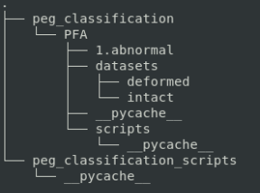
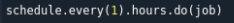
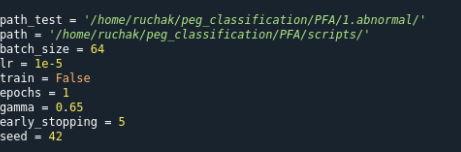

# Classification using ViT - an end-to-end model with DB update

Steps to runs this code:
1. Create an environment using miniforge. The command to that is:  
conda create -n peg_pfa python=3.10
2. Now that we have a conda environment, we would have to activate it:  
conda activate peg_pfa
3. Now, we need to clone this repository. This can be done by implementing the following command in a terminal:  
git clone https://seagit.okla.seagate.com/CAG/peg-classification-scripts-for-pfa.git
4. Go to the location where you git clone.
5. There is a requirements.txt file here. We need to install all the libraries with the specified versions present in it. This can be done using the following command:  
pip install -r requirements.txt
6. Before we start running the code, we need to make sure we are maintaining the path structures.  
  
In this image, we need to have the folder PFA we cloned from seagit in another folder called peg_classification. Hence, you would have to make a new folder called peg_classification manually or using the following command:  
Go in the location where you need to make the directory, and use:  
mkdir peg_classification
Copy the PFA folder we cloned. For inference, we need not worry about the 1.abnormal, datasets, deformed and intact folders. The code will handle all that.  
However, all of the scripts, main.py, models.py, datasets.py and model_checkpoint.pt(which we will get to in a minute) should be in a folder called scripts. So, in PFA folder, create a scripts folder and move all these python scripts to that folder. 
7. Regarding the model checkpoint, I have uploaded it here:  
https://seagatetechnology.sharepoint.com/:f:/r/teams/CAGDA/Shared%20Documents/peg_classification?csf=1&web=1&e=Ruc9ew  
We need to download it from here and move it to  
peg_classification --> PFA --> scripts --> model_checkpoint.pt
8. You can now just run the code by:  
python -W ignore pegs_pfa.py in a terminal. 
You might have to change a few location paths in some places. 
9. Let me walk you through the code now:  
a. We start with pegs_pfa.py located in peg_classification_scripts. This is the main wrapper script that calls all other components of the peg classification model. Line 32 here can help you if you want to change the scheduling. Currently it is set to run every hour.  
  
b. In the job function, we can see the first thing it does is get the new data. This function is present in dbs.py. For this, we are checking for all new data present in enseapedia.hamr_pfa_ai(James' table) but not present in hamr_ida_rw.peg_deformation_pfa(Rucha's table). By default, it would query for data updated in the last 1 year. However, if you want to query certain wafer lists or head lists, that can be done as well. So this function will return a dataframe of all the data updated in the last 1 year.  
c. If there is any new data, then it would clean the data using the cleanData function in peg_only_pfa.py. That will subset the data by all heads whose PEG_FROM CORE_URL_BB is present.  
d. The storeData will store all these new images in a location so the model can run on it.  
**You would have to make some location changes here**  
You would have to change all the locations to point to your locations. 
e. The runModels will run the model. We need to change the location here to point to the main.py in  
peg_classification-->PFA-->scripts-->main.py  
**You would have to make some location changes here**  
f. storeResults function load the results from the respective locations and upload the results to the database in hamr_ida_rw.peg_deformation_pfa. 
**You would have to make some location changes here**  
g. In the post processing script, it will send an email regarding an error if that occurs or an updated list of heads that are missing the URLs. In this script on line 16 and 17, you might have to change the email addresses. Sometimes, you get a lost connection error or a NoneType error. Ignore these. The lsot connection error occurs due to not being able to connect to the database properly. The NoneType error is because there is no new data. If there is any other error then you might want to take a look at it. 
  
  
**Training**
1. Open main.py in peg_classification-->scripts-->main.py
2. change the train to True, change the number of epochs, and any other hyperparameters you want to experiment with.  
  
Also, change the path and path_test variables to point to your datasets. These should point to dataframes df_train.csv, df_val.csv and df_test.csv. This csv should have HEAD_SERIAL_NUM(str) and Type(0 or 1). For test dataset, it wont have the Type. 
3. Uncomment lines 44, 45, 47 and 48 and comment line 46 and 49. The training will start if you run main.py
4. You can uncomment lines 173-187 to use SHAP library to understand what the model is learning. 

